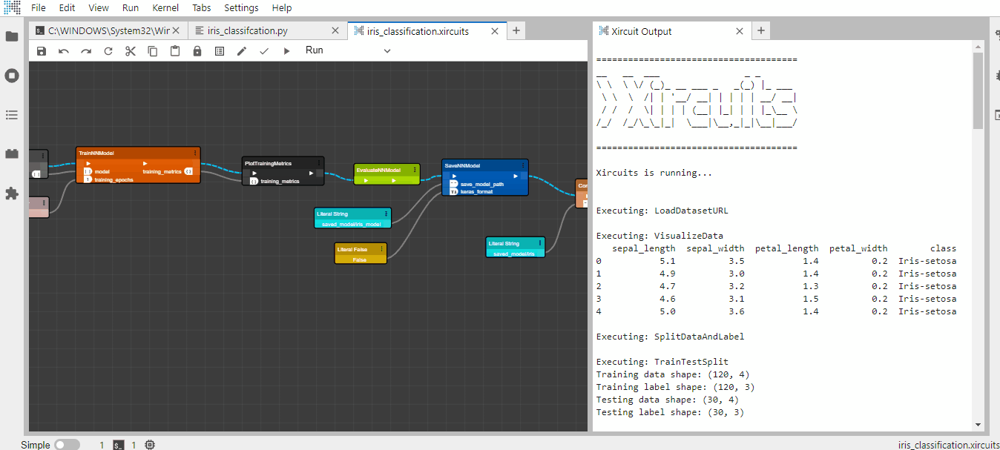

# Xircuits Iris Classification Project Template

This template allows you to train an iris classifier, using the [Iris dataset](http://archive.ics.uci.edu/ml/machine-learning-databases/iris/iris.data).

It consists of the components needed to build and train a one dimensional neural network model:

- Dataset preparation: this section handles the dataset used in this template through multiple components.

  - `LoadDatasetURL` : download Iris dataset from [URL](http://archive.ics.uci.edu/ml/machine-learning-databases/iris/iris.data).
  - `VisualizeData` : visualize the training data (optional)
  - `SplitDataAndLabel` : split data and label to X and Y respectively
  - `TrainTestSplit` : split data to training and testing dataset

- Model training: build and compile the model for training.
  - `Create1DModel` : building a one dimensional neural network model.
  - `TrainNNModel` : training the model with training dataset.
  - `PlotTrainingMetrics` : evaluate training performance, by plotting the training loss and accuracy against the number of training epochs.
  - `EvaluateNNModel` : determine the model loss and accuracy based on the testing dataset.
  - `SaveNNModel` : save model in keras or tensorflow format.
  - `ConvertTFModelToOnnx` : convert TF model to onnx model to be used in other platforms.

## Prerequisites

You will need Python 3.9+.

## Installation

1. Clone this repository
2. Create virtual environments and install the required python packages.

```
pip install -r requirements.txt
```

3. Run xircuits from the root directory

```
xircuits
```

## Workflow in this Template

#### IrisClassification.xircuits

- In this template, we used the iris dataset and perform a simple classification. You can further fine tune the model by modifying the hyperparameters.


